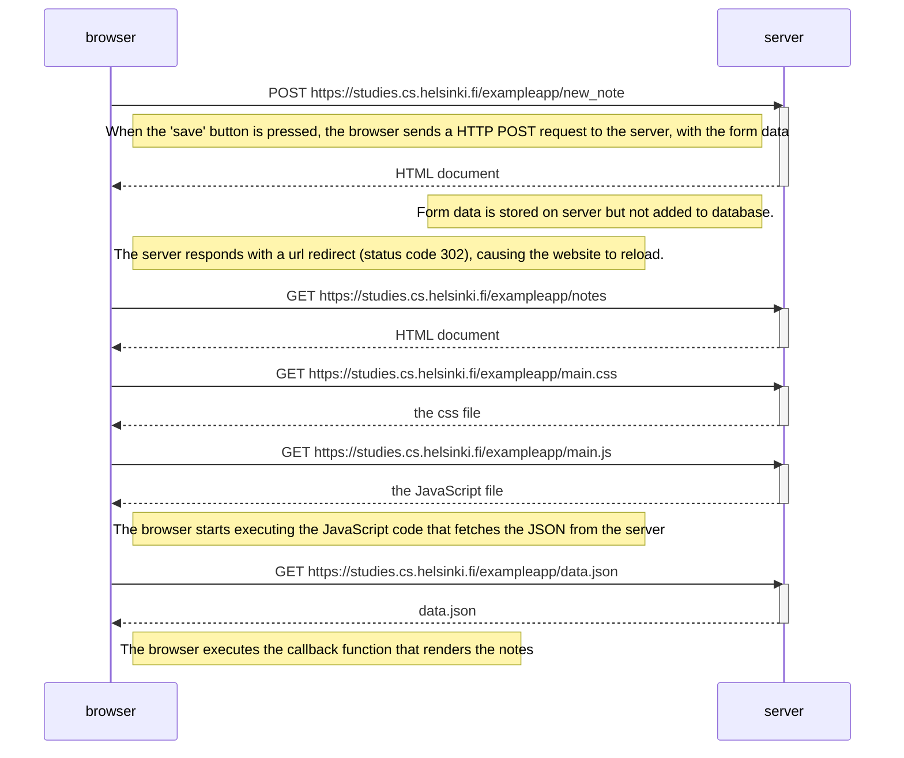

Exercise 0.4

A diagram depicting what happens when form data is sent to server.

```mermaid
sequenceDiagram
    participant browser
    participant server

    browser->>server: POST https://studies.cs.helsinki.fi/exampleapp/new_note
    activate server
    Note right of browser: When the 'save' button is pressed, the browser sends a HTTP POST request to the server, with the form data

    server-->>browser: HTML document
    deactivate server
    Note left of server: Form data is stored on server but not added to database. 
    Note right of browser: The server responds with a url redirect (status code 302), causing the website to reload. 

    browser->>server: GET https://studies.cs.helsinki.fi/exampleapp/notes
    activate server
    server-->>browser: HTML document
    deactivate server

    browser->>server: GET https://studies.cs.helsinki.fi/exampleapp/main.css
    activate server
    server-->>browser: the css file
    deactivate server

    browser->>server: GET https://studies.cs.helsinki.fi/exampleapp/main.js
    activate server
    server-->>browser: the JavaScript file
    deactivate server

    Note right of browser: The browser starts executing the JavaScript code that fetches the JSON from the server

    browser->>server: GET https://studies.cs.helsinki.fi/exampleapp/data.json
    activate server
    server-->>browser: data.json
    deactivate server

    Note right of browser: The browser executes the callback function that renders the notes
```
