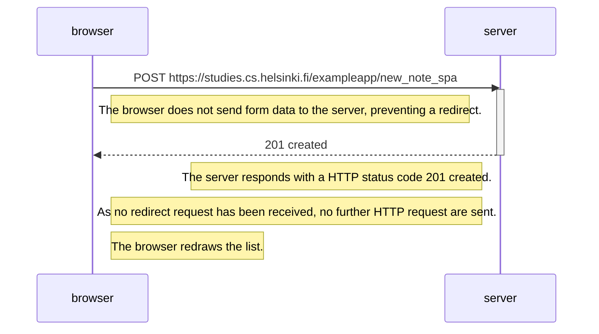

Exercise 0.6

In the SPA version of the website, when form data is added.

```mermaid
sequenceDiagram
    participant browser
    participant server

    browser->>server: POST https://studies.cs.helsinki.fi/exampleapp/new_note_spa
    activate server

    Note right of browser: The browser does not send form data to the server, preventing a redirect.

    server-->>browser: 201 created
    deactivate server

    Note left of server: The server responds with a HTTP status code 201 created.

    Note right of browser: As no redirect request has been received, no further HTTP request are sent.
    Note right of browser: The browser redraws the list.
 
```